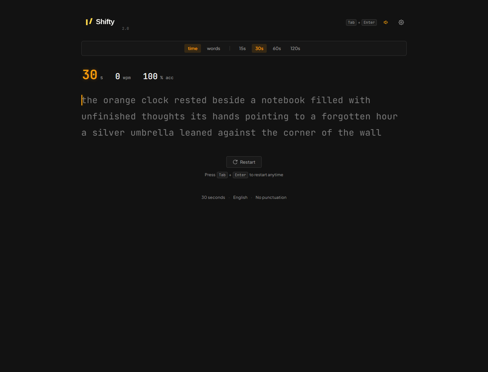

# Shifty

Shifty is a minimalist, keyboard-first typing speed test built with HTML, CSS, and TypeScript. It measures WPM, accuracy, raw speed, consistency, mistakes, and weak typing transitions in a single focused interface.



## Features

- Time mode: 15, 30, 60, and 120 seconds.
- Words mode: configurable word-count sessions.
- Live timer, WPM, and accuracy metrics.
- Dynamic word loading from `data/words-common.json`.
- In-code fallback vocabulary for offline or failed network requests.
- Local word generation while typing, so the test does not wait for an API.
- Font preferences for JetBrains Mono, Fira Code, Source Code Pro, Roboto Mono, Inconsolata, Space Mono, Cascadia Code, and system monospace.
- Caret style and typing sound preferences.
- Completion sound and visible notification when a session ends.
- Result screen with WPM history, accuracy, mistakes, weak spots, and recent sessions.
- Responsive mobile notice for keyboard-first use.

## Project structure

```text
Shifty/
├── index.html                 Application shell and semantic UI
├── css/                       Modular stylesheets
│   ├── index.css              Stylesheet entry point
│   ├── variables.css          Design tokens
│   ├── base.css               Reset and shared elements
│   ├── shell.css              Header and layout
│   ├── typing.css             Typing screen
│   ├── result.css             Results and performance chart
│   └── settings.css            Preferences and mobile notice
├── js/                        TypeScript source
│   ├── main.ts                Application bootstrap and screen state
│   ├── typing-engine.ts       Input, timer, scoring, and word rendering
│   ├── result-renderer.ts     Result metrics and SVG chart
│   ├── words.ts               Vocabulary loading and fallback pool
│   ├── settings.ts            Preferences and sound controls
│   ├── sound.ts               Web Audio feedback
│   ├── state.ts               Reactive application state
│   └── types.ts               Shared TypeScript types
├── data/
│   └── words-common.json      Additional common-word vocabulary
├── assets/                    Logo, icon, and screenshots
├── dist/                      Browser-ready compiled JavaScript
├── package.json               Build scripts
├── tsconfig.json              TypeScript configuration
└── AGENT.md                   Engineering notes for future agents
```

## Run locally

Install TypeScript if needed, then compile the browser modules:

```bash
npm install
npm run build
```

Serve the project from its root directory. A web server is required because the app uses ES modules and fetches the word JSON file.

```bash
python -m http.server 4173
```

Open [http://localhost:4173](http://localhost:4173).

For a type-check only:

```bash
npm run check
```

## How a session works

1. The typing screen loads the starter passage and fallback words immediately.
2. `words.ts` fetches `data/words-common.json` and merges valid words into the local pool.
3. The timer starts on the first valid printable character, not on page load or focus.
4. Words are rendered locally and extended as the user approaches the end of the current list.
5. When time reaches zero, input stops, a completion sound and notification are shown, and the result screen opens shortly afterward.
6. The result renderer draws the WPM and raw-WPM history as an SVG chart and fills the analysis sections.

## Customizing vocabulary

Add lowercase alphabetic words to `data/words-common.json`. The loader validates entries and ignores invalid values. The smaller fallback list remains in `js/words.ts` so the app still works if the data file cannot be fetched.

For a separate difficulty level, add another JSON file and select the appropriate pool in `words.ts`. Keep generation local during a session to avoid network latency affecting the typing measurement.

## Branding

The header uses the transparent SVG logo at `assets/shifty-lockup.svg`. The page title, package name, and visible UI use the Shifty name.

## License

MIT.
